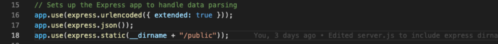

# Note_Taker

Note taker utilizing express.js to allow user to write and save notes. This application uses an Express.js back end and saves and retrieves note data from a JSON file.

## User Story

```
AS A small business owner
I WANT to be able to write and save notes
SO THAT I can organize my thoughts and keep track of tasks I need to complete
```


## Acceptance Criteria

```
GIVEN a note-taking application
WHEN I open the Note Taker
THEN I am presented with a landing page with a link to a notes page
WHEN I click on the link to the notes page
THEN I am presented with a page with existing notes listed in the left-hand column, plus empty fields to enter a new note title and the note’s text in the right-hand column
WHEN I enter a new note title and the note’s text
THEN a Save icon appears in the navigation at the top of the page
WHEN I click on the Save icon
THEN the new note I have entered is saved and appears in the left-hand column with the other existing notes
WHEN I click on an existing note in the list in the left-hand column
THEN that note appears in the right-hand column
WHEN I click on the Write icon in the navigation at the top of the page
THEN I am presented with empty fields to enter a new note title and the note’s text in the right-hand column
```


## Mock-Up

The following images show the web application's appearance and functionality: 


## Getting Started

The application has a `db.json` file on the back end that is used to store and retrieve notes using the `fs` module.

The following HTML routes were created:

* `GET /notes` returns the `notes.html` file.

* `GET *` returns the `index.html` file.

The following API routes were created:

* `GET /api/notes` reads the `db.json` file and returns all saved notes as JSON.

* `POST /api/notes` receives a new note to save on the request body, adds it to the `db.json` file, and then returns the new note to the client. 

## Challenges

The challenges faced in the project development process was getting the notes.html pages to look how it should. Initially, the page was showing an incorrect layout with two small box input fields for the notes to be entered into, and also no buttons for saving or editing the notes. There was also no side panel on the left for previously saved notes. To resolve this issue, in the server.js file where the express app was set up to handle data parsing, we needed to add an additional app.use as shown below:



Another challenge that was faced was getting the delete and edit buttons to work properly for each of the pre-existing notes that had been saved. When these buttons were clicked, nothing would happen and the notes would stay where they were. 


## Credits

Inquirer - [Inquirer](https://www.npmjs.com/package/inquirer)

Express - [Express](https://www.npmjs.com/package/express)

## Links

GitHub Repository - [Team Profile Generator Repository](https://github.com/ktrudickm/Note_Taker "Note Taker Repository")

Deployed Project - [Deployed Application](https://ktrudickm.github.io/Note_Taker/ "Deployed Application")

